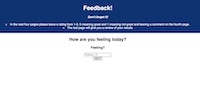
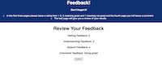

## Weekend Redux Feedback Loop
### Description
Duration: 3 day  Sprint
The problem we had for this project was to be able to create a feedback survey app. There were 4 pages with feedback that were created and a page that gave a review of all the feedback that was collected during the survey. When on the review page and submitted the info collected, this would be sent to a data base to store all the information. Then you would be able to restart and be able to take the feedback survey again. While taking it again you wouldn’t be able to see the previous feedback information. 
### Screen Shot
        [alt text](thankyou.jpg )
### Prerequisites
Link to software that is required to install the app (e.g. node).
•	Node.js
•	React
•	React Redux
•	Redux 
•	Postico
### Installation
1.	Create a database named prime_feedback
2.	The queries in the tables.sql file are set up to create all the necessary tables and populate the needed data to allow the application to run correctly. The project is built on Postgres, so you will need to make sure to have that installed. We recommend using Postico to run those queries as that was used to create the queries,
3.	The data base information and is in the file named data.sql
4.	Open up your editor of choice and run an npm install, npm install redux, npm install react-redux and npm install redux-logger
5.	Run npm run server in your terminal
6.	Run npm run client in your terminal
7.	The npm run client command will open up a new browser tab for you!
### Usage
How does someone use this application? Tell a user story here.
1.	This is a feedback app. Which means it’s a little feedback survey to see how you’re feeling, what’s your understanding, how well do you feel supported and a chance to leave a comment. 
2.	These four feedbacks will have its own page. Feeling, understanding, and supported will be a rating from 1-5. 5 being great and 1 not so great. Then the comment page will allow you to leave a comment on how everything is going. 
3.	After this is all done the app will take you to a review page and will be able to see all the feedback that was left. 
4.	On the review back you will be able to submit the feedback. 
5.	Once the submit button is clicked you will be able to start another feedback survey if needed.
### Built With
•	JavaScript
•	VS code
•	Postico
•	React
•	React Redux
•	Redux
•	Node.js
•	Postman 
### Acknowledgement
Thanks to Prime Digital Academy who equipped and helped me to make this application a reality. Thanks to my instructor Matt Black and the Gemini cohort for being there for support and helping when getting stuck. Also, a huge thanks to my Wife, family and friends for all their support. 
### Support
If you have suggestions or issues, please email me at Nick.Ilacqua@yahoo.com. 

